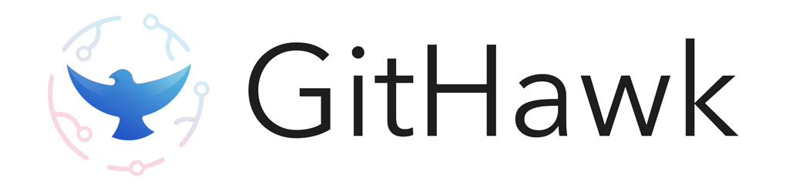

<a href="https://itunes.apple.com/app/githawk-for-github/id1252320249"></a>
<p align="center"><a href="https://itunes.apple.com/app/githawk-for-github/id1252320249"></a></p>

<p align="center">
    <a href="https://www.bitrise.io/app/a912ff037bca7072">
        
    </a>
    <a href="https://testflight.apple.com/join/QIVXLkkn">
      
    </a>
</p>

GitHawk is the second-highest rated iOS app for GitHub.

|         | Features  |
----------|-----------------
:zero: | _Inbox Zero_ your notifications
:pencil: | Comment even faster than on GitHub desktop
:thumbsup: | The only app with emoji reactions!
:zap: | Native markdown rendering
:octocat: | 100% free and open source

## Contributing

We are always looking for contributions from **all skill levels**! A great way to get started is by helping [organize and/or squish bugs](https://github.com/GitHawkApp/GitHawk/issues?utf8=✓&q=is%3Aissue+is%3Aopen+label%3A%22🐛+bug%22). If you're looking to ease your way into the project try out a [good first issue](https://github.com/GitHawkApp/GitHawk/issues?utf8=✓&q=is%3Aissue+is%3Aopen+label%3A%22✨+good+first+issue%22+).

#### Highest Priority Needs:

- 👩‍💼 **Product Manager**
  - We have some [projects](https://github.com/GitHawkApp/GitHawk/projects) and tons of unorganized/unprioritized [features](https://github.com/GitHawkApp/GitHawk/issues?utf8=✓&q=is%3Aissue+is%3Aopen+label%3A%22🆕+feature+request%22+). GitHawk needs someone to own the product direction!
- 👩‍🎨 **Designer**
  - Like making unique UIs? So do we! We value keeping GitHawk's UX close to core iOS, but, when necessary, create our own high-quality UI components. Helping design for GitHawk is a great opportunity to try new ideas out!
- 👩‍💻 **iOS Project Management**
  - There is a _lot_ of low-hanging fruit with our project setup, test and deployment automation, build optimizations, and more! I ([@rnystrom](https://github.com/rnystrom)) have no idea what I'm doing here. Come point us in the right direction!

## Installation

If you want to build GitHawk locally, run `npm install`.

To get started, you will need to install node (`brew install node`), then run these instructions:

```sh
git clone https://github.com/GitHawkApp/GitHawk.git
cd GitHawk
bundle
bundle exec pod install
npm install
open Freetime.xcworkspace/
```

This will install [apollo-codegen](https://github.com/apollographql/apollo-codegen) that is required to generate the GraphQL models.

See the [setup guide](https://github.com/GitHawkApp/GitHawk/blob/master/Setup.md) for details about API keys and environment variables.

## Open Source & Copying

We ship GitHawk on the App Store for free and provide its entire source code for free as well. In the spirit of openness, GitHawk is licensed under MIT so that you can use my code in your app, if you choose.

However, **please do not ship this app** under your own account. Paid or free.

## Why are we building this?

- Push [IGListKit](https://instagram.github.io/IGListKit/) + Swift to its limits
- Better GitHub project management on mobile
- Explore [GitHub's GraphQL API](https://developer.github.com/v4/)
- Scratch my Swift-itch
- Create a real, complex app in the open
