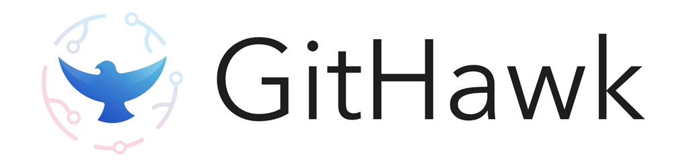

<a href="https://itunes.apple.com/app/githawk-for-github/id1252320249"></a>
<p align="center"><a href="https://itunes.apple.com/app/githawk-for-github/id1252320249"></a></p>

[](https://www.bitrise.io/app/a912ff037bca7072)

GitHawk is the highest rated iOS app for GitHub.

|         | Features  |
----------|-----------------
:zero: | _Inbox Zero_ your notifications
:pencil: | Comment even faster than on GitHub desktop
:thumbsup: | The only app with emoji reactions!
:zap: | Native markdown rendering
:octocat: | 100% free and open source

## Installation

If you want to build GitHawk locally, run `npm install`.

To get started, you will need to install node (`brew install node`), then run these instructions:

```sh
git clone https://github.com/rnystrom/GitHawk.git
cd GitHawk
bundle
bundle exec pod install
npm install
open Freetime.xcworkspace/
```

This will install [apollo-codegen](https://github.com/apollographql/apollo-codegen) that is required to generate the GraphQL models.

See the [setup guide](Setup.md) for details about API keys and environment variables.

## Open Source & Copying

We ship GitHawk on the App Store for free and provide its entire source code for free as well. In the spirit of openness, GitHawk is licensed under MIT so that you can use my code in your app, if you choose.

However, **please do not ship this app** under your own account. Paid or free.

## Contributing

:warning: This repo is moving _fast_! :warning:

If you would like to test the latest changes, you can join the **TestFlight** beta by DMing your e-mail address to [@_ryannystrom](https://twitter.com/_ryannystrom).

## Why are we building this?

- Push `IGListKit` + Swift to its limits
- Better GitHub project management on mobile
- Explore [GitHub's GraphQL API](https://developer.github.com/v4/)
- Scratch my Swift-itch
- Create a real, complex app in the open
